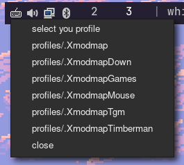

# XmodmapProfiler
-----------------
 - Aplicação em python para alteração de layout X11 usando xmodmap pela área de notificação. 

## Exemplos de uso
-----------------
Essa aplicação é melhor utilizada caso você não possa, ou seja difícil alterar o layout do seu teclado, ou já use vários layouts com xmodmap.
Você pode criar layouts para outras línguas, para jogos, facilitar shortcuts em aplicativos, para utilizar seu teclado como um mouse.
E com XmodmapProfiler você pode alterar entre os layouts de forma rápida e simples, com 2 cliques no system tray. 

## Pré-requisitos
-----------------
Antes de utilizar, você deve ter atender os seguintes requisitos:

- Utilizar algum window manager X11, xmodmap não altera layouts em sistemas wayland.
- Possuir uma taskbar para acessar o system tray.
- Instalar globalmente Pystray.
- Instalar Pillow, globalmente, ou dentro de uma venv.
- Opcionalmente pyinstaller para compilar em executável.

## Instalação
-----------------
Instalando todas dependências necessárias, é recomendável que você utilize um ambiente virtual python (venv) para instalações de pacotes com pip, infelizmente pystray está com um problema de dependência e não esta funcionado quando instalado em uma venv, então instalar o pacote globalmente resolve o problema.

Clone o projeto e entre na pasta
```
git clone https://github.com/JoaoAntonioBonfim/XmodmapProfiler.git
cd XmodmapProfiler
```

Instalando pystray. Exemplo de instalação em arch linux:
```
sudo pacman -S python-pystray
```

Criação de ambiente virtual:
```
python -m venv .venv
```

Ativação do ambiente virtual:
```
.venv\Scripts\activate
```

Instalação do Pillow
```
pip install Pillow
```

Opcionalmente compile com pyinstaller.
```
pyinstaller --onefile trayProfiler.py
```

E de as permissões de execução com chmod.
```
chmod +x trayProfiler
```

Crie uma pasta profiles/ e mantenha no mesmo diretório do executável.
```
mkdir profiles/
```

## Como usar 
-----------------
- Inicialize o programa, com python, ou o executável.
- Opcionalmente adicione o programa nas opções de inicialização do seu sistema.
- Adicione seus arquivos de layout .xmodmap em "profiles/" 
- Clique no ícone na área de notificação e selecione o layout desejado.


